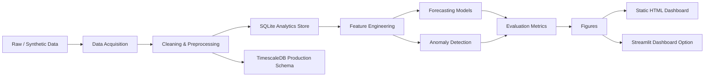

# GreenPower Utilities — Energy Consumption Analytics

An end-to-end energy analytics capstone for transforming raw electricity, renewable-generation, and weather data into a clean hourly time-series layer, engineered forecasting features, predictive models, anomaly flags, and a dashboard-ready reporting system.

## Project Overview

GreenPower Utilities demonstrates how a modern utility analytics workflow can be designed from ingestion to reporting. The project combines data cleaning, time-series storage, feature engineering, machine-learning based demand forecasting, robust anomaly detection, and executive dashboarding into one reproducible pipeline.

The implementation is intentionally designed for both **local reproducibility** and **production awareness**. The default pipeline runs with calibrated sample data and SQLite so it can be evaluated anywhere, while the database design also includes a TimescaleDB-oriented production path for scalable time-series workloads.

## Capstone Details

| Item | Details |
|---|---|
| **Capstone Project** | GreenPower Utilities — Energy Consumption Analytics |
| **Programme** | M.Tech Data Engineering, IIT Jodhpur |
| **Team** | Harshit Nirmal Jain (G25AI1021)<br>K R Devika (G25AI1022)<br>Kartik Dadhich (G25AI1023)<br>Kirtiman Sarangi (G25AI1024)<br>Kollipara Teja (G25AI1025) |
| **Inspired by** | *Enhancing anomaly detection in electrical consumption profiles through computational intelligence* |
| **Authors** | Santiago Felipe Luna-Romero, Xavier Serrano-Guerrero, Mauren Abreu de Souza, Guillermo Escrivá-Escrivà |
| **Journal** | *Energy Reports*, Volume 11, June 2024, Pages 951–962 |
| **Paper DOI** | [10.1016/j.egyr.2023.12.045](https://doi.org/10.1016/j.egyr.2023.12.045) |
| **Focus Areas** | Smart-meter analytics, demand forecasting, anomaly detection, renewable-energy context, and operational dashboarding |

---

## Table of Contents

- [Executive Summary](#executive-summary)
- [Problem Statement](#problem-statement)
- [Project Objectives](#project-objectives)
- [System Architecture](#system-architecture)
- [Pipeline Overview](#pipeline-overview)
- [Data Sources](#data-sources)
- [Cleaning and Preprocessing](#cleaning-and-preprocessing)
- [Storage Design](#storage-design)
- [Feature Engineering](#feature-engineering)
- [Forecasting Models](#forecasting-models)
- [Anomaly Detection](#anomaly-detection)
- [Dashboard and Reporting](#dashboard-and-reporting)
- [Results Summary](#results-summary)
- [Quick Start](#quick-start)
- [Repository Structure](#repository-structure)
- [Reproducibility](#reproducibility)
- [Professional Scope and Limitations](#professional-scope-and-limitations)
- [References](#references)
- [Team](#team)

---

## Executive Summary

GreenPower Utilities is a six-week data-engineering capstone that demonstrates how utility-scale energy data can be converted into actionable analytics. The repository implements a complete pipeline that begins with raw or synthetic energy data and ends with a dashboard-ready analytics layer.

The system is designed to be both **portable** and **production-aware**:

- **Portable:** The default pipeline uses calibrated synthetic data and SQLite, so it can be executed locally without external credentials, private data, or cloud infrastructure.
- **Production-aware:** The repository includes a TimescaleDB-oriented schema design for time-series storage, continuous aggregates, compression, and future scale-out deployment.
- **Analytics-ready:** The pipeline produces cleaned hourly datasets, engineered features, forecasts, anomaly flags, evaluation metrics, figures, and a dashboard.
- **Research-aligned:** The project is grounded in smart-meter analytics, non-intrusive load monitoring, energy forecasting, and building-energy anomaly detection literature.

---

## Problem Statement

Energy utilities and sustainability teams need reliable visibility into electricity consumption patterns, demand peaks, abnormal load behavior, and renewable-energy variability. However, raw energy datasets are rarely ready for direct analytics. They often contain missing timestamps, sensor spikes, irregular resolutions, inconsistent units, and limited contextual information.

A practical analytics platform must therefore solve four problems before meaningful insights can be produced:

1. Convert heterogeneous raw data into a consistent time-series format.
2. Clean spikes, gaps, duplicates, and timestamp inconsistencies.
3. Generate reliable features for forecasting and operational analysis.
4. Detect abnormal consumption behavior in a transparent and reproducible way.

GreenPower Utilities addresses these requirements through an end-to-end data-engineering and analytics workflow.

---

## Project Objectives

| Objective | Description |
|---|---|
| O1 — Data Foundation | Build a clean hourly time-series layer from energy and weather data. |
| O2 — Storage Design | Support local reproducibility through SQLite and production-oriented design through TimescaleDB migrations. |
| O3 — Feature Engineering | Create calendar, lag, rolling-window, weather, degree-hour, and peak-load features. |
| O4 — Forecasting | Train and compare baseline, linear, and neural forecasting models. |
| O5 — Anomaly Detection | Detect abnormal demand behavior using an interpretable robust statistical method. |
| O6 — Visualization | Generate figures and a dashboard for operational reporting. |
| O7 — Reproducibility | Provide a single-command pipeline that rebuilds outputs from source data. |

---

## System Architecture



The architecture separates the project into four layers:

| Layer | Responsibility |
|---|---|
| Data Layer | Source acquisition, schema standardization, raw/cleaned data management |
| Storage Layer | SQLite runtime store and TimescaleDB production schema |
| Analytics Layer | Features, forecasting, anomaly detection, evaluation |
| Presentation Layer | Figures, static HTML dashboard, Streamlit option |

---

## Pipeline Overview

The complete pipeline runs in the following order:

```text
acquire -> clean -> store -> features -> models -> anomaly -> figures -> dashboard
```

| Stage | Module | Output |
|---|---|---|
| Acquire | `src/data_acquisition.py` | Raw consumption, generation, and weather files |
| Clean | `src/clean.py` | Cleaned hourly datasets and cleaning report |
| Store | `src/storage.py` | SQLite database and load-audit tables |
| Features | `src/features.py` | Feature tables, rollups, peak metrics, degree-hour features |
| Models | `src/models.py` | Forecasts, model metrics, model summary |
| Anomaly | `src/anomaly.py` | Anomaly flags, precision, recall, flagged-hour summary |
| Visualization | `src/viz.py` | Dashboard-ready figures |
| Dashboard | `dashboard/build_static.py` | Self-contained static HTML dashboard |

---

## Data Sources

The repository supports two modes.

| Mode | Description | Best Use |
|---|---|---|
| `synthetic` | Generates calibrated sample data matching the expected schema and seasonality. | Default reproducible run, grading, local testing |
| `real` | Intended for prepared public datasets such as household electricity, SCADA wind, and weather data. | Extended analysis and real-data validation |

Recommended real-data families:

| Data Family | Example Source Type | Role |
|---|---|---|
| Household electricity demand | UCI-style household electricity data, UK-DALE, ECO-style datasets | Forecasting target and consumption analytics |
| Renewable generation | SCADA wind turbine or generation datasets | Capacity-factor and green-power context |
| Weather | NOAA-style station weather | Temperature sensitivity, heating/cooling degree-hours |
| Grid / tariff metadata | Utility or open tariff references | Optional contextual reporting |

The project defaults to synthetic calibrated data because a capstone repository must be easy to run, easy to verify, and independent of private credentials.

---

## Cleaning and Preprocessing

The cleaning stage converts raw measurements into consistent hourly UTC time series.

| Cleaning Task | Method |
|---|---|
| Timestamp normalization | Convert timestamps to UTC and sort chronologically |
| Duplicate handling | Drop duplicate timestamps |
| Spike detection | Use robust median absolute deviation based despiking |
| Hourly alignment | Reindex each series to a complete hourly grid |
| Short-gap imputation | Interpolate short missing gaps up to a defined limit |
| Completeness tracking | Record whether a value is original, imputed, or unavailable |
| Long-gap treatment | Mask or remove readings that cannot be trusted after cleaning |

Cleaning outputs:

```text
data/cleaned/
outputs/cleaning_report.json
```

---

## Storage Design

The project uses a dual storage strategy.

| Storage Option | Purpose | Location |
|---|---|---|
| SQLite | Lightweight, reproducible, local execution | `data/greenpower.db` |
| TimescaleDB | Production-style time-series design | `db/migrations/*.sql` |

The SQLite path makes the repository runnable on any standard development machine. The TimescaleDB path demonstrates how the same analytical design can be moved toward a production-grade time-series database.

Production-oriented database concepts represented in the repository include:

- Fact tables for consumption, generation, and weather
- Reference tables for sources and weather stations
- Composite indexes for time-series lookup patterns
- Continuous aggregate style feature views
- Compression-aware historical storage design
- Load-audit tracking

---

## Feature Engineering

The feature layer converts cleaned time series into supervised learning and reporting features.

| Feature Group | Examples | Purpose |
|---|---|---|
| Calendar features | Hour, day of week, month, weekend flag, season | Captures recurring behavior |
| Cyclical encodings | `hour_sin`, `hour_cos`, `doy_sin`, `doy_cos` | Represents cyclic time correctly |
| Lag features | 1-hour, 24-hour, 168-hour lags | Captures short-term, daily, and weekly memory |
| Rolling statistics | 24-hour mean and standard deviation | Captures recent trend and volatility |
| Weather joins | Temperature, wind speed, precipitation | Adds exogenous drivers |
| Degree-hours | Heating and cooling degree-hours | Models weather-driven demand |
| Load metrics | Peak-to-average ratio, load factor, peak hour | Supports operational interpretation |
| Generation metrics | Wind capacity factor, daily generation | Adds renewable-energy context |

Feature outputs are stored in the database and exported for reporting.

---

## Forecasting Models

The forecasting layer predicts next-hour electricity demand using a chronological hold-out design.

| Model | Type | Role |
|---|---|---|
| Seasonal-naive | Statistical baseline | Uses demand from 168 hours earlier |
| Ridge regression | Linear ML model | Interpretable benchmark using engineered features |
| MLP neural network | Non-linear ML model | Strong default runnable model |
| LSTM | Optional deep sequence model | Production-oriented extension if TensorFlow is installed |

Model artifacts:

```text
outputs/evaluation_summary.csv
outputs/forecasts.csv
outputs/model_stats.json
```

---

## Anomaly Detection

The implemented anomaly detector is intentionally interpretable. Each reading is compared against the expected demand for its hour-of-day and month group. The residual is scaled using median absolute deviation, and the system flags:

- sustained deviations over consecutive hours,
- isolated hard spikes,
- abnormal demand behavior under injected test scenarios.

This approach gives a transparent baseline that is suitable for operational reporting. The project can later be extended toward prediction-residual anomaly detection, autoencoders, sequence models, or NILM-informed diagnostics.

Anomaly outputs:

```text
outputs/anomaly_flags.csv
outputs/anomaly_stats.json
```

---

## Dashboard and Reporting

The dashboard layer converts pipeline outputs into a self-contained reporting artifact.

```bash
python dashboard/build_static.py
open dashboard/dashboard.html
```

Dashboard panels include:

| Panel | Purpose |
|---|---|
| Daily Load Profile | Shows recurring demand behavior and evening peaks |
| Forecast vs Actual | Compares predictions with observed consumption |
| Model Error Comparison | Summarizes MAE, RMSE, and MAPE |
| Anomaly Monitor | Shows abnormal consumption periods |
| Consumption vs Temperature | Visualizes weather sensitivity |
| Renewable Performance | Summarizes generation and capacity-factor behavior |

---

## Interactive Dashboard

Alongside the static HTML report, an interactive multi-page Streamlit app
(`dashboard/app.py`) reads the live pipeline outputs and renders zoomable,
hoverable Plotly charts. Launch it with `streamlit run dashboard/app.py`
(opens at `http://localhost:8501`).

### Roll-number login (team access)

The live dashboard is gated. Only Group 5 roll numbers can sign in:

| Name | Roll |
|------|------|
| Harshit Nirmal Jain | G25AI1021 |
| K R Devika | G25AI1022 |
| Kartik Dadhich | G25AI1023 |
| Kirtiman Sarangi | G25AI1024 |
| Kollipara Teja | G25AI1025 |

Enter the roll number on the login screen (case-insensitive). After sign-in,
the sidebar shows the signed-in member and a **Sign out** button. Page
navigation is hidden until login succeeds.

| Page | Highlights |
|------|------------|
| Overview | headline KPIs, pipeline flow, dataset coverage, full-history trend |
| Consumption | date-range + weekday/weekend filters, load profile, hour × weekday heatmap, temperature scatter, sub-meter breakdown |
| Forecasting | model selector, error leaderboard, forecast vs actual, residual + predicted-vs-actual plots, CSV export |
| Anomaly Detection | precision/recall/F1, zoomable anomaly stream, confusion matrix, flagged-hours log, CSV export |
| Wind Generation | capacity factor by month, generation trend, wind power curve |
| Data Quality | per-dataset completeness, raw→clean row counts, database inventory, cleaning report |

Shared theme, auth, cached data loaders and Plotly styling live in
`dashboard/lib.py`.

### Deploy on Streamlit Community Cloud

1. Push this repository to GitHub (see commands at the end of your local workflow).
2. Go to [share.streamlit.io](https://share.streamlit.io) → **New app**.
3. Select the repo, branch `master`, and set:
   - **Main file path:** `dashboard/app.py`
   - **Python version:** 3.11+ (or the default offered)
4. Click **Deploy**.

On first boot the app auto-runs `python run_pipeline.py` if
`data/greenpower.db` is missing (the DB is gitignored). That takes ~30–60
seconds once; later visits reuse the generated files on the cloud instance.
Team members then open the public URL and sign in with their roll number.

---

## Results Summary

Latest documented results from the project pipeline:

| Metric | Result |
|---|---:|
| Seasonal-naive MAPE | 28.5% |
| Ridge regression MAPE | 17.3% |
| MLP neural net MAPE | 13.9% |
| RMSE improvement vs baseline | 55% lower than seasonal-naive |
| Anomaly precision | 0.97 |
| Anomaly recall | 0.88 |

Key interpretation:

- Calendar, lag, rolling, and weather features improve load forecasting over the seasonal baseline.
- The MLP model gives the best lightweight runnable forecast performance.
- Robust statistical anomaly detection performs strongly on injected outage and spike scenarios.
- The architecture is suitable for extension into more advanced smart-meter analytics.

---

## Quick Start

### 1. Clone the repository

```bash
git clone https://github.com/Kirtiman-sarangi/greenpower-capstone.git
cd greenpower-capstone
```

### 2. Create an environment

```bash
python -m venv .venv
source .venv/bin/activate
```

For Windows:

```bash
.venv\Scripts\activate
```

### 3. Install dependencies

```bash
pip install -r requirements.txt
```

### 4. Run the complete pipeline

```bash
python run_pipeline.py
```

### 5. View the dashboard

Interactive multi-page app (recommended for demos):

```bash
streamlit run dashboard/app.py            # opens http://localhost:8501
```

Sign in with a Group 5 roll number (e.g. `G25AI1025`).

Or build the static, dependency-free HTML report:

```bash
python dashboard/build_static.py
open dashboard/dashboard.html
```

---

## Repository Structure

```text
greenpower-capstone/
├── README.md
├── run_pipeline.py
├── requirements.txt
├── docker-compose.yml
│
├── src/
│   ├── config.py
│   ├── data_acquisition.py
│   ├── clean.py
│   ├── storage.py
│   ├── features.py
│   ├── models.py
│   ├── anomaly.py
│   └── viz.py
│
├── db/
│   └── migrations/
│
├── dashboard/
│   ├── app.py               # interactive Streamlit entry (Overview + login)
│   ├── lib.py               # shared theme, roll-number auth, data loaders
│   ├── pages/               # Consumption, Forecasting, Anomaly, Wind, Data Quality
│   ├── build_static.py
│   └── dashboard.html
│
├── .streamlit/
│   └── config.toml          # Streamlit Cloud theme / server settings
│
├── data/
│   ├── raw/
│   ├── cleaned/
│   └── greenpower.db
│
├── outputs/
│   ├── figures/
│   ├── cleaning_report.json
│   ├── feature_stats.json
│   ├── evaluation_summary.csv
│   ├── forecasts.csv
│   ├── model_stats.json
│   ├── anomaly_flags.csv
│   └── anomaly_stats.json
│
├── notebooks/
└── reports/
```

---

## Reproducibility

A reproducible run should generate the following artifacts:

```text
data/raw/
data/cleaned/
data/greenpower.db
outputs/cleaning_report.json
outputs/feature_stats.json
outputs/evaluation_summary.csv
outputs/forecasts.csv
outputs/model_stats.json
outputs/anomaly_flags.csv
outputs/anomaly_stats.json
outputs/figures/
dashboard/dashboard.html
```

Recommended verification steps:

```bash
python run_pipeline.py
ls data/greenpower.db
ls outputs/
python dashboard/build_static.py
ls dashboard/dashboard.html
```

---

## Professional Scope and Limitations

This repository is designed as a capstone-quality analytics system, not a production utility deployment. The default pipeline uses calibrated synthetic data for portability and repeatability. Real-data execution requires preparing public datasets in the expected schema.

Current strengths:

- Fully runnable local pipeline
- Clear modular design
- Strong feature-engineering workflow
- Forecasting and anomaly-detection outputs
- Dashboard-ready presentation layer
- Production-aware TimescaleDB design

Recommended future enhancements:

- Add automated data validation tests
- Add CI workflow for pipeline smoke tests
- Add model registry and experiment tracking
- Add online anomaly detection for streaming smart-meter data
- Add richer evaluation with F1 score, event-level recall, and detection delay
- Add real-data benchmark notebooks using open datasets

---

## References

[1] Hart, G. W. “Nonintrusive appliance load monitoring.” *Proceedings of the IEEE*, 80(12), 1870–1891, 1992. DOI: [10.1109/5.192069](https://doi.org/10.1109/5.192069)

[2] Beckel, C., Kleiminger, W., Cicchetti, R., Staake, T., and Santini, S. “The ECO Data Set and the Performance of Non-Intrusive Load Monitoring Algorithms.” *Proceedings of the 1st ACM Conference on Embedded Systems for Energy-Efficient Buildings*, 2014.

[3] Kelly, J., and Knottenbelt, W. “The UK-DALE dataset, domestic appliance-level electricity demand and whole-house demand from five UK homes.” *Scientific Data*, 2015.

[4] Batra, N., Kelly, J., Parson, O., Dutta, H., Knottenbelt, W., Rogers, A., Singh, A., and Srivastava, M. “NILMTK: An Open Source Toolkit for Non-intrusive Load Monitoring.” *Proceedings of ACM e-Energy*, 2014.

[5] Liu, X., and Nielsen, P. S. “Scalable prediction-based online anomaly detection for smart meter data.” *Information Systems*, 2018.

[6] Fan, C., Xiao, F., Zhao, Y., and Wang, J. “Analytical investigation of autoencoder-based methods for unsupervised anomaly detection in building energy data.” *Applied Energy*, 2018.

[7] Zoha, A., Gluhak, A., Imran, M. A., and Rajasegarar, S. “Non-Intrusive Load Monitoring Approaches for Disaggregated Energy Sensing: A Survey.” *Sensors*, 2012.

[8] Himeur, Y., Alsalemi, A., Bensaali, F., and Amira, A. “Artificial intelligence based anomaly detection of energy consumption in buildings: A review.” *Applied Energy*, 2021.

---

## Team

- Harshit Nirmal Jain (G25AI1021)
- K R Devika (G25AI1022)
- Kartik Dadhich (G25AI1023)
- Kirtiman Sarangi (G25AI1024)
- Kollipara Teja (G25AI1025)
